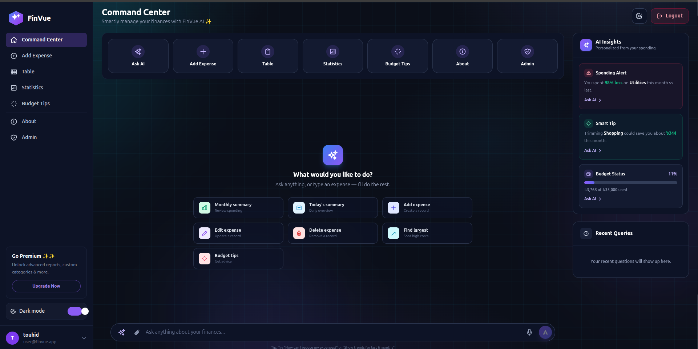

<div align = "center">

### 📚 FinVue : Expense Tracker 📚

##### 💰 A modern, full-stack expense tracker built with Next.js 🚀

**---🧾 Track daily expenses, visualize spending, and get AI-powered insights 🧾---**


<div align = "center">
  
</div>

<hr>
</div>

### ✨ FinVue : Features

- **Authentication**: JWT-based signup/login with bcrypt password hashing.
- **Expense Management**: Add, edit, delete, and view expenses.
- **Filters & Sorting**: Filter by category, date, and search.
- **Dashboard & Statistics**: Category breakdowns and spending trends.
- **AI Assistant**: Chat to analyze spending and get budgeting tips.
- **Admin Panel**: Manage users, expenses, and view API logs.
- **Dark/Light Mode**: Theme toggle with smooth transitions.
- **Offline Support**: Changes queue locally and sync on reconnect.


<hr>

### 🐚 FinVue : Setup Instructions (Manual)

- 📌 Clone the repository :

```
git clone https://github.com/touhid9teen/ExpenseTracker.git
```

- 📌 Go to the project directory and run the following command

```
cd ExpenseTracker
```

- 📌 Install Require Package

```
npm install
```

- 📌 Create a `.env.local` file with the following keys :

```
APP_ENV=development
DATABASE_URL="your-neon-postgres-database-url"
JWT_SECRET="your-secure-jwt-secret"
GEMINI_API_KEY="your-gemini-api-key"
```

- 📌 Initialize the database :

```
node scripts/init-db.mjs
```

- 📌 Start the dev server

```
npm run dev
```

- 📌 To visit the website, Open the Browser and go to the following URL

```
http://localhost:3000/
```

<hr>

### 🐚 FinVue : Setup Instructions (Docker)

- 📌 Create a `.env` file in the project root with the same keys as `.env.local` :

```
DATABASE_URL="your-neon-postgres-database-url"
JWT_SECRET="your-secure-jwt-secret"
GEMINI_API_KEY="your-gemini-api-key"
```

- 📌 Build and start the app (the `db-init` service applies the schema first) :

```bash
docker compose up --build
```

- 📌 To run using the existing image, run the following command

```bash
docker compose up
```

- 📌 Re-run the schema manually (if needed) :

```bash
docker compose run --rm db-init
```

- 📌 Stop Docker after you finish visiting the website

```bash
docker compose down
```

- 📌 Docker is running properly !

<hr>

### 📚 FinVue : Documentation

- 📌 Project Structure : **( [ 👉 Click Here](./PROJECT_STRUCTURE.md) )**
- 📌 Entity Relationship : **( [ 👉 Click Here](./ENTITY_RELATIONSHIP.md) )**

<hr>

### 📄 License

This project is licensed under the MIT License. See the [LICENSE](./LICENSE) file for details.
